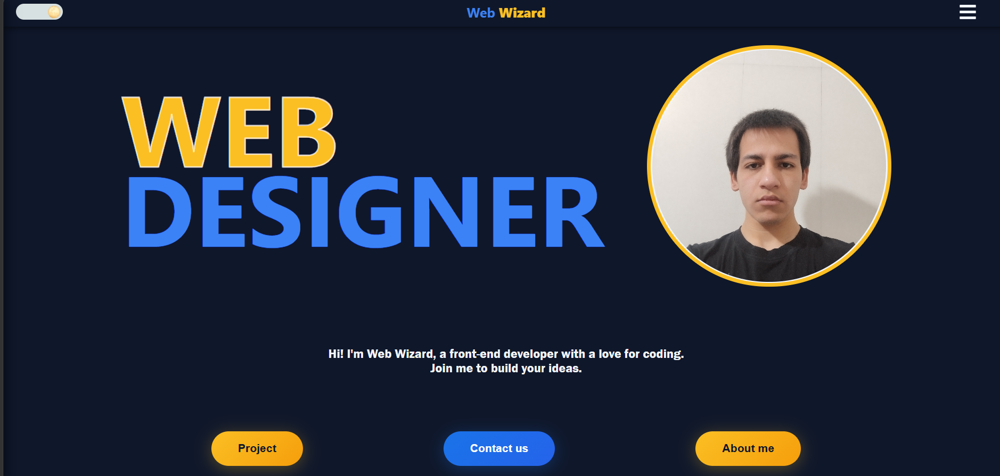
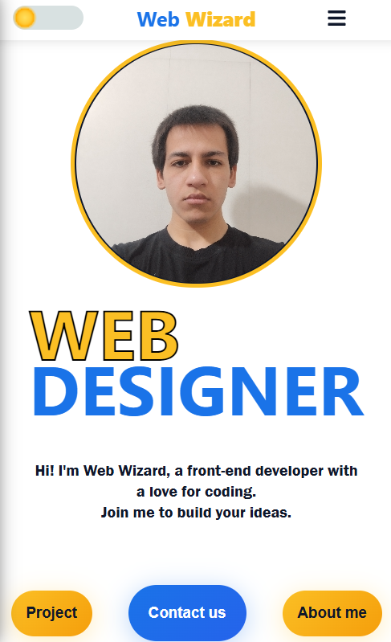

# Personal Portfolio Website
A modern, responsive personal portfolio website built with React.


## 🔗 Live Demo
https://webwizard696.github.io/My-personal-website/


## ✨ Features
- Fully responsive design (mobile-first)
- Dark/Light theme toggle with animation
- Hamburger menu with slide-in navigation
- Smooth scroll between sections
- Multi-language support
- Contact section with social links


## 🛠️ Technologies Used
- React - Frontend framework
- JavaScript (ES6+) - Logic and interactivity
- HTML5 - Structure
- CSS3 - Styling (Flexbox, Grid, Animations)


## 📂 Project Structure

```
src/
├── components/
│   ├── Header/
│   ├── Hero/
│   ├── Projects/
│   ├── About/
│   ├── Contact/
│   └── Footer/
├── data/
├── App.jsx
└── index.js
```

# 📸 Screenshots
🙏 Sorry I am ugly 🙏



<p align="center">
    
</p>

## 🙏 Acknowledgements
"Special thanks to my mentor for his invaluable guidance throughout my JavaScript and React journey."


## 📬 Contact
- Email: web.wizard.696@gmail.com
- GitHub: https://github.com/webwizard696


## 📄 License
This project is open source and available under the MIT License.

---
### 👨‍💻 Developer: Mohammad Hamze

**Web Wizard 🧙** | I ❤️ code